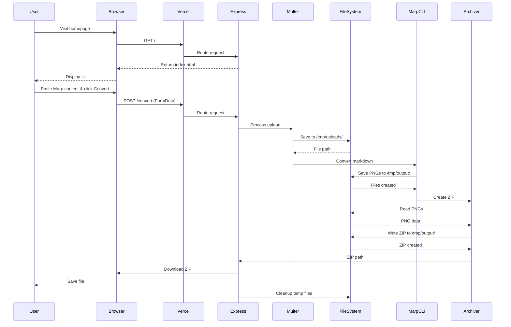
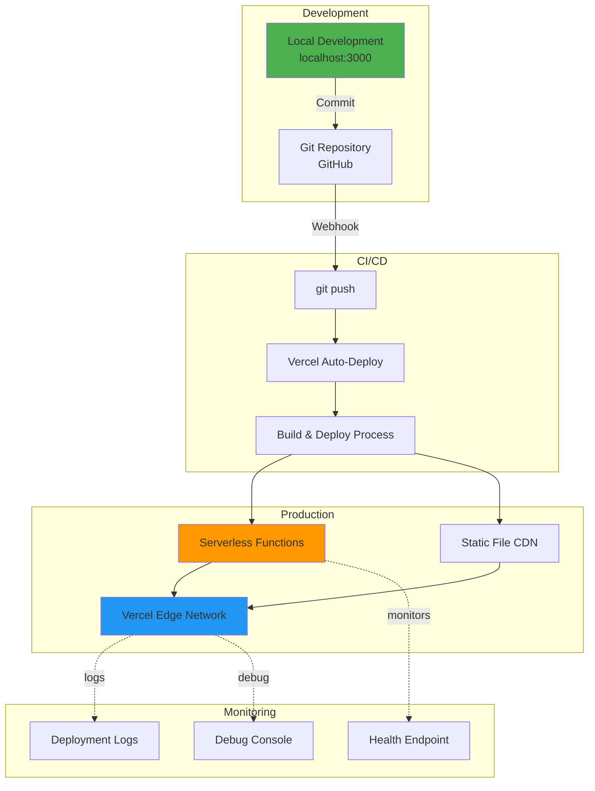
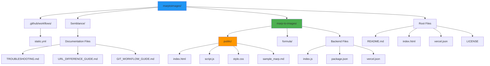
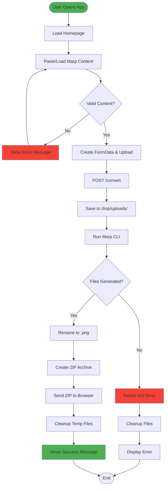
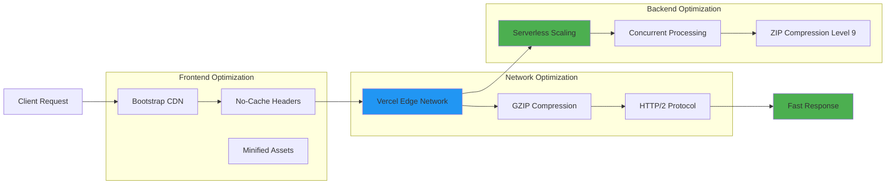
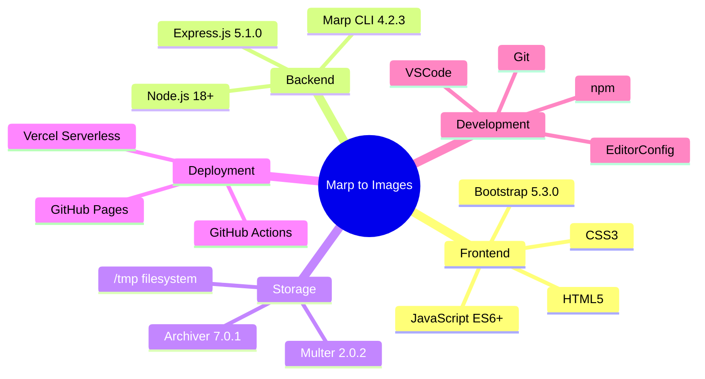
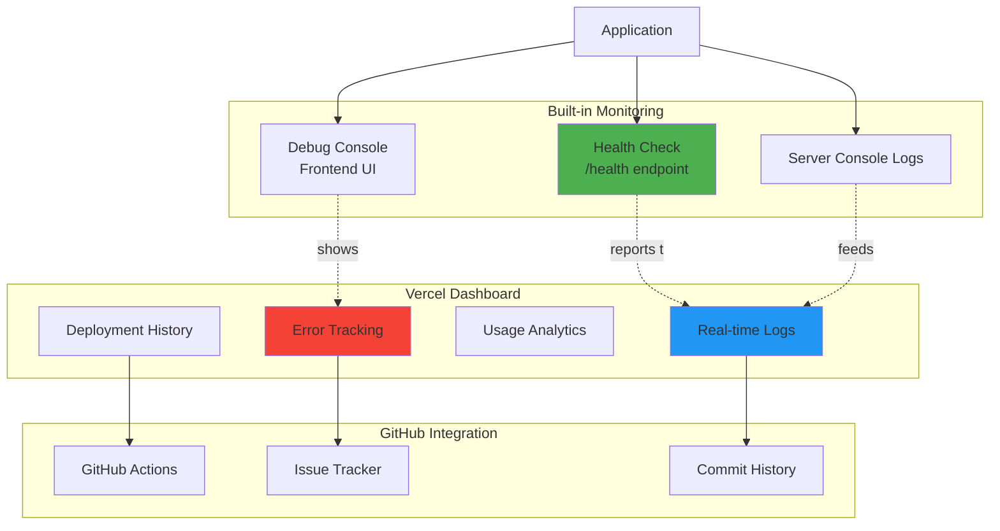
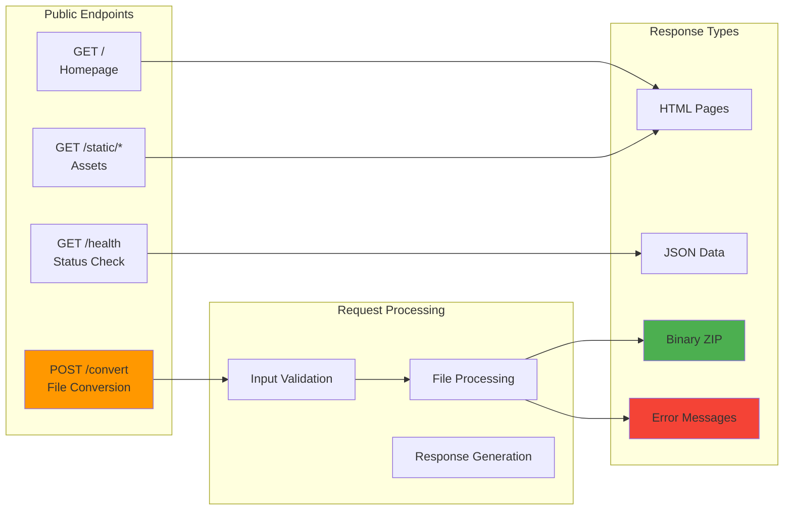

# Marp to Images - Architecture

**Version:** 1.0.3  
**Last Updated:** January 8, 2025

---

## 🏗️ System Architecture

```mermaid
graph TB
    subgraph "Client Layer"
        Browser[Web Browser]
        GHPages[GitHub Pages]
    end
    
    subgraph "CDN & Static Assets"
        Bootstrap[Bootstrap CSS/JS]
        StaticFiles[Static Files: CSS, JS, HTML]
    end
    
    subgraph "Vercel Serverless Platform"
        subgraph "Express.js Application"
            Routes[Route Handlers]
            Middleware[Middleware Layer]
            HealthCheck[Health Check Endpoint]
        end
        
        subgraph "File Processing"
            Multer[Multer File Upload]
            TmpStorage[/tmp Storage]
            MarpCLI[Marp CLI Converter]
            Archiver[ZIP Archiver]
        end
    end
    
    Browser -->|HTTPS Request| Routes
    GHPages -->|Redirect| Browser
    Browser -->|Load Assets| StaticFiles
    Browser -->|Load Styles| Bootstrap
    
    Routes -->|POST /convert| Middleware
    Routes -->|GET /health| HealthCheck
    Routes -->|GET /| StaticFiles
    
    Middleware -->|Validate| Multer
    Multer -->|Save| TmpStorage
    TmpStorage -->|Read| MarpCLI
    MarpCLI -->|Generate PNG| TmpStorage
    TmpStorage -->|Package| Archiver
    Archiver -->|Download| Browser
    
    style Browser fill:#4CAF50
    style Routes fill:#2196F3
    style MarpCLI fill:#FF9800
    style TmpStorage fill:#9C27B0
```

---

## 📊 Request Flow Diagram



---

## 🏛️ Component Architecture

```mermaid
graph LR
    subgraph "Frontend Components"
        HTML[index.html]
        CSS[style.css]
        JS[script.js]
    end
    
    subgraph "Backend Components"
        Server[Express Server]
        Router[Route Handlers]
        Upload[File Upload Logic]
        Converter[Marp Converter]
        Zipper[ZIP Creator]
        Cleanup[Cleanup Service]
    end
    
    subgraph "External Dependencies"
        ExpressNPM[express@5.1.0]
        MarpNPM[@marp-team/marp-cli@4.2.3]
        MulterNPM[multer@2.0.2]
        ArchiverNPM[archiver@7.0.1]
    end
    
    HTML --> JS
    JS --> Server
    Server --> Router
    Router --> Upload
    Router --> Converter
    Router --> Zipper
    Zipper --> Cleanup
    
    Server -.uses.-> ExpressNPM
    Upload -.uses.-> MulterNPM
    Converter -.uses.-> MarpNPM
    Zipper -.uses.-> ArchiverNPM
```

---

## 🌐 Deployment Architecture



---

## 📁 File Structure



---

## 🔄 Data Flow



---

## 🛡️ Security Architecture

```mermaid
graph TB
    subgraph "Input Validation"
        FileType[File Type Check<br/>.md, .markdown]
        FileSize[Size Limit Check<br/>5MB max]
        MimeType[MIME Type Validation]
    end
    
    subgraph "Processing Security"
        Isolation[Serverless Isolation]
        TmpOnly[/tmp Only Access]
        AutoCleanup[Auto Cleanup]
    end
    
    subgraph "Output Security"
        NoExec[No Code Execution]
        SafeDownload[Safe Download Headers]
        HTTPS[HTTPS Only]
    end
    
    Request[User Request] --> FileType
    FileType --> FileSize
    FileSize --> MimeType
    
    MimeType --> Isolation
    Isolation --> TmpOnly
    TmpOnly --> AutoCleanup
    
    AutoCleanup --> NoExec
    NoExec --> SafeDownload
    SafeDownload --> HTTPS
    HTTPS --> Response[Secure Response]
    
    style FileType fill:#FF5722
    style Isolation fill:#FF5722
    style HTTPS fill:#FF5722
```

---

## ⚡ Performance Architecture



---

## 🔧 Technology Stack



---

## 📈 Scalability Architecture

```mermaid
graph TB
    subgraph "Auto-Scaling"
        Request[Incoming Request]
        Router[Vercel Router]
        Scale{Load Level?}
    end
    
    subgraph "Serverless Instances"
        Func1[Function Instance 1]
        Func2[Function Instance 2]
        Func3[Function Instance 3]
        FuncN[Function Instance N...]
    end
    
    subgraph "Resource Management"
        CPU[CPU: 1 vCPU]
        Memory[Memory: 1024 MB]
        Timeout[Timeout: 30s]
        TmpSpace[/tmp: 512 MB]
    end
    
    Request --> Router
    Router --> Scale
    
    Scale -->|Low| Func1
    Scale -->|Medium| Func2
    Scale -->|High| Func3
    Scale -->|Very High| FuncN
    
    Func1 -.uses.-> CPU
    Func1 -.uses.-> Memory
    Func1 -.uses.-> Timeout
    Func1 -.uses.-> TmpSpace
    
    style Scale fill:#FF9800
    style FuncN fill:#4CAF50
```

---

## 🔍 Monitoring & Debugging



---

## 📚 API Architecture



---

## Summary

This architecture document provides a comprehensive visual overview of the Marp to Images application, including:

- **System Architecture**: Overall structure and component relationships
- **Request Flow**: Step-by-step process from user interaction to response
- **Component Architecture**: Frontend, backend, and dependency relationships
- **Deployment Architecture**: Development to production pipeline
- **File Structure**: Organization of project files and directories
- **Data Flow**: User journey from input to output
- **Security Architecture**: Validation and protection mechanisms
- **Performance Architecture**: Optimization strategies
- **Technology Stack**: Complete technology overview
- **Scalability Architecture**: Auto-scaling and resource management
- **Monitoring & Debugging**: Observability and troubleshooting
- **API Architecture**: Endpoint structure and processing

All diagrams are in Mermaid format and can be rendered in GitHub, documentation sites, or any Mermaid-compatible viewer.
